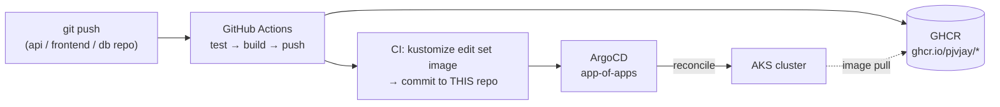

# pantry-gitops

GitOps repo for the [pantry-platform](https://github.com/pjvjay/pantry-platform)
demo. **ArgoCD watches this repo; the cluster converges to whatever is
committed here.** Nobody runs `kubectl apply` against the app — a git commit
is the only deployment mechanism.

## The loop



## Layout

```
argocd/                     App-of-Apps control plane
├── root-app.yaml           the seed (applied once by pantry-infra / kubectl)
├── project.yaml            AppProject: scoped repos, namespaces, cluster perms
├── apps-application.yaml   child app → apps/  (Kustomize)
└── infra-application.yaml  child app → infra/ (directory, recursive)

apps/                       Workloads — synced by pantry-apps
├── kustomization.yaml      ← image tags live HERE; CI bumps them
├── migrate-job.yaml        PreSync hook: pantry-db migrations before rollout
├── pantry-api/             Deployment (:8000) + Service
├── pantry-frontend/        Deployment (nginx :80) + Service
└── pantry-ingress/         /pantry → frontend · /pantry/api → api (rewrite)

infra/                      Slow-changing platform pieces — synced by pantry-infra
├── namespaces.yaml         pantry-app + pantry-db
├── postgres-cluster.yaml   CNPG Cluster (Postgres 17, 1 instance)
└── external-secrets/       Key Vault ⇄ K8s projections (no secret values in git)
```

## Sync ordering

ArgoCD applies resources in `sync-wave` order; hooks run around each sync:

| Wave / phase | Resource | Why |
|---|---|---|
| -15 | Namespaces | everything lives in them |
| -10 | ExternalSecrets | CNPG bootstrap + app pods need the credentials |
| -5 | CNPG Cluster | database up before anything speaks to it |
| PreSync hook | `pantry-db-migrate` Job | schema migrated **before** workloads roll |
| 0 | Deployments, Services, Ingress | the app itself |

## Secrets

No secret values exist in this repo — only *references*:

```
Azure Key Vault ──(External Secrets Operator + Workload Identity)──▶ K8s Secrets
   pantry-db-password   → pantry-app-credentials   (pantry-db + pantry-app ns)
   anthropic-api-key    → anthropic-credentials    (pantry-app ns)
```

Rotate in Key Vault; ESO re-syncs within 1h (or force with an annotation).
The `pantry-db-password` entry is created by
[pantry-infra](https://github.com/pjvjay/pantry-infra)'s Terraform.

## Common operations

**Deploy a new API version** — you don't. Push to
[pantry-api](https://github.com/pjvjay/pantry-api); its CI bumps
`apps/kustomization.yaml` here and ArgoCD rolls the Deployment.

**Roll back** — revert the bump commit:

```bash
git revert HEAD && git push   # ArgoCD converges back within ~3 min
```

**Add a schema migration** — push a numbered SQL file to
[pantry-db](https://github.com/pjvjay/pantry-db); the PreSync Job applies it
on the next sync, before the app rolls.

**Add a whole new service** — new directory under `apps/` + entry in
`apps/kustomization.yaml`. No ArgoCD changes needed.

## Bootstrap (once per cluster)

Prereqs on the cluster (provisioned by
[lifeguide-infra](https://github.com/pjvjay/lifeguide-infra) on this AKS):
ArgoCD, ingress-nginx, cert-manager, CloudNativePG operator, External
Secrets Operator with a `ClusterSecretStore` named `azure-key-vault`.

```bash
# Option A — Terraform (preferred): pantry-infra applies the root app + KV secret
cd pantry-infra && terraform apply

# Option B — by hand:
kubectl apply -f argocd/root-app.yaml
```

Either way, the root Application pulls `argocd/`, which creates the
AppProject + child Applications, which create everything else. Watch it:

```bash
kubectl get applications -n argocd
# pantry-root   Synced  Healthy
# pantry-apps   Synced  Healthy
# pantry-infra  Synced  Healthy
```

Live URL: https://lifeguide-dev-67c717e5.canadacentral.cloudapp.azure.com/pantry/
