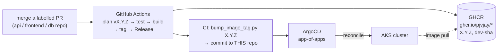

# pantry-gitops

GitOps repo for the [pantry-platform](https://github.com/pjvjay/pantry-platform)
demo. **ArgoCD watches this repo; the cluster converges to whatever is
committed here.** Nobody runs `kubectl apply` against the app — a git commit
is the only deployment mechanism.

## The loop


```mermaid
flowchart LR
    dev["merge a labelled PR<br/>(api / frontend / db repo)"]
    ci["GitHub Actions<br/>plan vX.Y.Z → test → build<br/>→ tag → Release"]
    ghcr[("GHCR<br/>ghcr.io/pjvjay/*<br/>X.Y.Z, dev-sha")]
    bump["CI: bump_image_tag.py X.Y.Z<br/>→ commit to THIS repo"]
    argo["ArgoCD<br/>app-of-apps"]
    aks["AKS cluster"]

    dev --> ci --> ghcr
    ci --> bump --> argo -->|"reconcile"| aks
    aks -.->|"image pull"| ghcr
```

Each app repo's `build.yml` releases a version on merge and sets it here
(`newTag: X.Y.Z`; `bump_image_tag.py --digest` can pin
`digest: sha256:... # X.Y.Z` instead). The process, the release labels and
the platform release train are in
[RELEASING.md](https://github.com/pjvjay/pantry-platform/blob/main/RELEASING.md).

## Layout

```
argocd/                     App-of-Apps control plane
├── root-app.yaml           the seed (applied once by pantry-infra / kubectl)
├── project.yaml            AppProject: scoped repos, namespaces, cluster perms
├── apps-application.yaml   child app → apps/  (Kustomize)
└── infra-application.yaml  child app → infra/ (directory, recursive)

apps/                       Workloads — synced by pantry-apps
├── kustomization.yaml      ← image pins live HERE; CI sets them
├── migrate-job.yaml        PreSync hook: pantry-db migrations before rollout
├── pantry-api/             Deployment (:8000) + Service
├── pantry-frontend/        Deployment (nginx :80) + Service
└── pantry-ingress/         /pantry → frontend · /pantry/api → api (rewrite)

infra/                      Slow-changing platform pieces — synced by pantry-infra
├── namespaces.yaml         pantry-app + pantry-db
├── postgres-cluster.yaml   CNPG Cluster (Postgres 17, 1 instance)
└── external-secrets/       Key Vault ⇄ K8s projections (no secret values in git)

scripts/                    stdlib Python; tests: python3 -m unittest discover -s scripts
├── bump_image_tag.py       the app repos' deploy step: one pin, newTag or --digest
└── check_images.py         every rendered image pinned, none latest (verify.yml)
```

## Sync ordering

ArgoCD applies resources in `sync-wave` order; hooks run around each sync:

| Wave / phase | Resource | Why |
|---|---|---|
| -15 | Namespaces | everything lives in them |
| -10 | ExternalSecrets | CNPG bootstrap + app pods need the credentials |
| -5 | CNPG Cluster | database up before anything speaks to it |
| PreSync hook | `pantry-db-migrate` Job | schema migrated **before** workloads roll |
| 0 | Deployments, Services, Ingress | the app itself |

## Secrets

No secret values exist in this repo — only *references*:

```
Azure Key Vault ──(External Secrets Operator + Workload Identity)──▶ K8s Secrets
   pantry-db-password   → pantry-app-credentials   (pantry-db + pantry-app ns)
   anthropic-api-key    → anthropic-credentials    (pantry-app ns)
   pantry-mcp-tokens    → pantry-mcp-credentials   (pantry-app ns)
```

Rotate in Key Vault; ESO re-syncs within 1h (or force with an annotation).
The `pantry-db-password` and `pantry-mcp-tokens` entries are created by
[pantry-infra](https://github.com/pjvjay/pantry-infra)'s Terraform.

`pantry-mcp-tokens` holds the bearer tokens for the API's `/mcp` endpoint
as `label:secret[,label:secret]`; the api Deployment reads it as
`MCP_AUTH_TOKENS` with `optional: true`, so the API Deployment still rolls
on a cluster without the entry (anonymous `/mcp`, submission tools
disabled) — but the `pantry-mcp-credentials` ExternalSecret itself reports
Degraded until the entry exists, so run pantry-infra's Terraform first.
`MCP_AUTH_TOKENS` is an environment variable: a value created or rotated
after the api pod started takes effect only after
`kubectl rollout restart deployment/pantry-api -n pantry-app`. To point an
MCP client at the cluster, pick ONE entry by label and pass its secret as
`--header "Authorization: Bearer <secret>"` to `claude mcp add`:

```bash
az keyvault secret show --vault-name <kv> --name pantry-mcp-tokens \
  --query value -o tsv | tr ',' '\n' | awk -F: '$1=="terraform"{print $2}'
```

## Common operations

**Deploy a new API version** — you don't. Merge a labelled PR to
[pantry-api](https://github.com/pjvjay/pantry-api); its `build.yml` releases
vX.Y.Z, commits "Deploy pantry-api X.Y.Z (pjvjay/pantry-api@<sha>)" here and
ArgoCD rolls the Deployment.

**Roll back** — revert the deploy commit:

```bash
git revert HEAD && git push   # ArgoCD converges back within ~3 min
```

Or dispatch the app repo's `build.yml` with `promote_version: X.Y.Z` to
deploy an earlier release again without a rebuild. Tags never move; the fix
ships as the next version.

**Add a schema migration** — merge a numbered SQL file to
[pantry-db](https://github.com/pjvjay/pantry-db); its release sets the
migrate image here and the PreSync Job applies it on the next sync, before
the app rolls.

**Add a whole new service** — new directory under `apps/` + entry in
`apps/kustomization.yaml`, pinned by a tag or digest (verify.yml refuses
`latest` or no tag). No ArgoCD changes needed.

## Bootstrap (once per cluster)

Platform prerequisites on the target cluster (any cluster satisfying this
contract works): ArgoCD, ingress-nginx, cert-manager (`ClusterIssuer`
`letsencrypt-prod`), CloudNativePG operator, and External Secrets Operator
with a `ClusterSecretStore` named `azure-key-vault`. Set your ingress
hostname in `apps/pantry-ingress/` (placeholder `pantry.example.com`).

```bash
# Option A — Terraform (preferred): pantry-infra applies the root app + KV secret
cd pantry-infra && terraform apply

# Option B — by hand:
kubectl apply -f argocd/root-app.yaml
```

Either way, the root Application pulls `argocd/`, which creates the
AppProject + child Applications, which create everything else. Watch it:

```bash
kubectl get applications -n argocd
# pantry-root   Synced  Healthy
# pantry-apps   Synced  Healthy
# pantry-infra  Synced  Healthy
```

The app lands at `https://<cluster-host>/pantry/` — the dev cluster runs on
demand (stopped when idle, $0 compute); ArgoCD self-heals the whole stack back
within minutes of `az aks start`.
